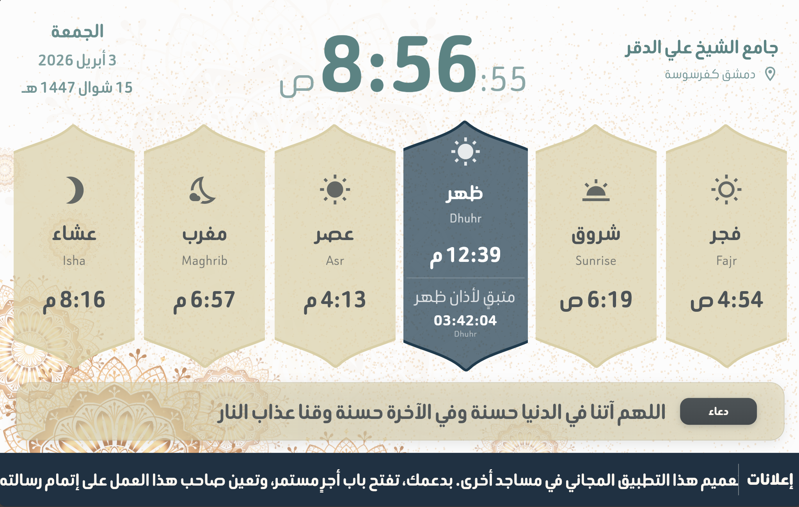

# Mosque Smart Display & Settings 🕌


A comprehensive, real-time Smart Mosque solution built with Flutter. This project provides a beautiful, customizable display for prayer times, announcements, and spiritual content, seamlessly synchronized across devices via the Tebyan backend (HTTP + WebSocket).



---

## 🚀 Key Features

*   **Real-time Prayer Times:** Automatic calculation and display of prayer times using the `adhan` package, with instant synchronization across all connected screens.
*   **Dynamic Countdown:** Accurate countdown timers for the next prayer and Iqamah times.
*   **Advanced Customization:** 
    *   Customizable themes (Colors, Fonts, Backgrounds).
    *   Support for multiple background types (Solid, Gradient, Image).
    *   Granular control over font sizes and styles for every UI element.
*   **Instant Alerts & Announcements:** Real-time push notifications and scrollable marquee announcements for the congregation.
*   **Multi-Language Support:** Fully localized supporting Arabic and English (English by default, easily switchable).
*   **Hijri Calendar:** Integrated Hijri date display with manual adjustment options.
*   **Spiritual Content:** Display of Hadiths, Quranic verses, and DHikr.
*   **Offline Resilience:** Graceful handling of network interruptions with local caching and calculation fallback.
*   **Over-the-Air Updates:** Integrated with **Shorebird** for seamless, instant app updates without requiring a manual re-install.

---

## ✨ Project Advantages

*   **Premium UI/UX:** Modern, sleek, and high-contrast design optimized for large mosque displays.
*   **High Performance:** Built with **Flutter** and optimized with **BLoC** for smooth state management.
*   **Infinite Scalability:** Powered by a dedicated backend (REST + WebSocket) plus Firebase Cloud Messaging for push delivery.
*   **Extreme Flexibility:** Adjust prayer time offsets, calculation methods (MWL, ISNA, Egypt, etc.), and jurisdictional settings (Hanafi, Shafi'i).
*   **User-Friendly Admin:** Manage everything from a dedicated mobile settings interface.

---

## 🏗️ Architecture & Tech Stack

This project follows **Clean Architecture** principles to ensure maintainability and testability:

*   **Core:** Common utilities, themes, enums, localization, and the realtime transport.
*   **Data:** Models, repository implementations, and data sources (HTTP/WebSocket via the Tebyan backend, local Hive cache).
*   **Features:** Modularized logic and UI (Auth, Display, Settings, Language, Splash).
*   **State Management:** `flutter_bloc` for predictable state transitions.
*   **Navigation:** `go_router` for robust routing.
*   **Network:** `dio` for HTTP + `web_socket_channel` for live snapshots.
*   **Local Storage:** `Hive` for snapshot cache, `flutter_secure_storage` for auth tokens.

---

## 🛠️ Local Setup

1.  **Prerequisites:**
    *   Flutter SDK (^3.10.7).
    *   A running Tebyan backend (see `mosques-backend/`).
    *   A Firebase project (FCM only) configured for Android/iOS.
2.  **Configure the backend URL** via `--dart-define`:
    ```bash
    flutter run \
      --dart-define=API_BASE_URL=http://10.0.2.2:8080/api/v1 \
      --dart-define=WS_BASE_URL=ws://10.0.2.2:8080/api/v1
    ```
    On Android emulator the host's localhost is `10.0.2.2`; on iOS sim and
    web use `localhost`. Skip the flags to fall back to the localhost
    defaults baked into `core/config/api_config.dart`.
3.  **Run the project:**
    ```bash
    flutter pub get
    flutter run
    ```

---

## 📞 Contact for a Free Account 🎁

To benefit from a **completely free, fully active account** and explore the full potential of this smart mosque system, please reach out to the project creator:

**Mounir Almzayek**
*   **GitHub:** [Mounir-Almzayek](https://github.com/Mounir-Almzayek)
*   **Inquiries:** Please contact me via GitHub or LinkedIn for access to a live demo and a free active account.

---

*Developed for the benefit of mosques worldwide.*
